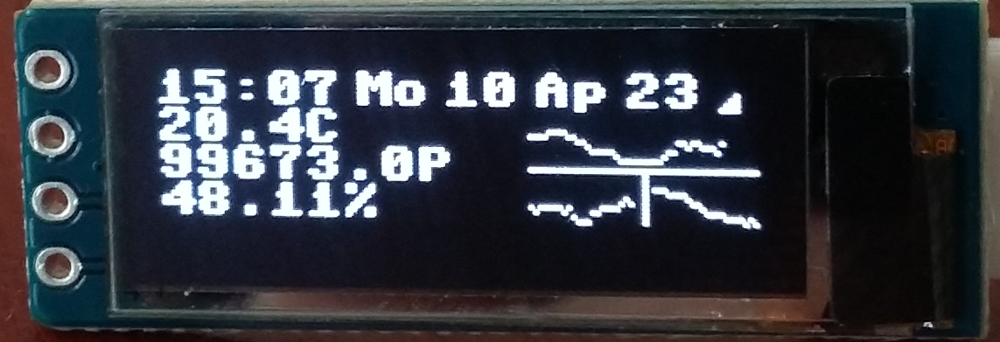

### Using Micropython and a Pico W to build a simple temperature server

The Pico W collects the sensor data from a BME280 environment sensor every 6 minutes. It updates a
SSD3106 120x32 OLED display with time and data and small graphs of the last 48/24 readings.

The Pico W also serves as a simple web server sending to a web browser a page which will show all the data for the last 24 hours in graph format.

There are many ways to access the data on the Pico W.

1. Python client which will download the data in JSON (client.py).
2. Rust client which will download the data in JSON (src/main.rs).
3. Use a web browser to view the page. http://ip-address:65510. The page contains Java script which will send a XHR request every 6 mins to collect the data and update the graphs.

### Used by this project:

    bme280_float.py from https://github.com/robert-hh/BME280.git
    ssd1306.py from https://github.com/stlehmann/micropython-ssd1306.git
 
### To Use

1 Create a wlanc.py

    password = "Your WLAN password"
    ssid = "your SSID"

Don't put your wlanc.py on github or anywhere on the internet. The .gitignore already has an entry for wlanc.py.

2 Upload wlanc.py main.py and TempDisplay.py as well as the above two Python files to your Pico W using Thonny

3 Create a sub folder called web on the Pico W file system (using Thonny) and upload index.html and graph.js to it

I assume you are already familaur with the basic of using a Pico W. See Raspberry Pi Pico Docs for more info if needed.

#### TODO
1 Add a button to the breadboard to allow different formats of display on the OLED
2 Tidy up the index.html to show the stats in a better format.

